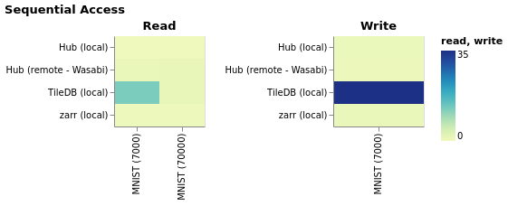
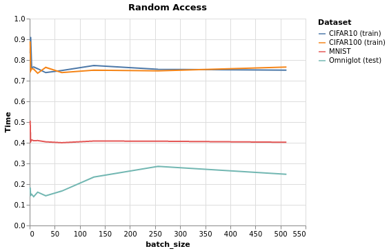

# Benchmarking

## Motivation
As the number of Hub users grew, it seemed wise to verify one of the key advantages of Hub: its performance. A standard way to measure the performance of a framework is to provide a process for comparisons to discover the industry winner under the same conditions and metrics. Hub claims to be:

> Fastest unstructured dataset management for TensorFlow/PyTorch.

The goal of the benchmarks is to show what areas of performance this claim applies to and to guide Hub's team towards in which Hub has still some room for improvement. The benchmarks are split into internal and external ones. The former suggest the relative conditions which are optimal for Hub to maximize its performance. The latter are to determine Hub's place on the ML scene among other actors like *PyTorch*, *Tensorflow*, *zarr* or *TileDB*.

## Method

All of the benchmarks were conducted on the same machine unless stated otherwise in a section related to a particular benchmark. The specification of the resources used for the benchmarks can be found below:

### Computation
<table>
  <tr>
    <th>Machine</th>
    <td>AWS EC2 m4.10xlarge instance</td>
  </tr>
  <tr>
    <th>Region</th>
    <td>US-East-2c</td>
  </tr>
    <tr>
    <th>Memory</th>
    <td>160 GB</td>
  </tr>
    <tr>
    <th>CPU</th>
    <td>Intel(R) Xeon(R) CPU E5-2676 v3 @ 2.40GHz</td>
  </tr>
    <tr>
    <th>#vCPU</th>
    <td>40</td>
  </tr>
     <tr>
    <th>Network performance</th>
    <td>10 Gb</td>
  </tr>
</table>

### Storage

| Type of storage | Volume | Maximum storage bandwidth |
| --- | --- | --- |
| Instance storage (EBS) | 1000 GB | 4000 Mbps |
| S3 Bucket | *unlimited* | 25 Gbps |
| Wasabi | | |

### Operating System
<table>
  <tr>
    <th>Kernel</th>
    <td>4.14.214-160.339.amzn2.x86_64 GNU/Linux</td>
  </tr>
  <tr>
    <th>OS Name</th>
    <td>Amazon Linux 2 (Karoo)</td>
  </tr>
    <tr>
    <th>Filesystem</th>
    <td>xfs</td>
  </tr>
</table>

### Datasets

#### Internal Use

| Name | Data Description | Split | Size (MB) | Number of items |
| --- | --- | --- | ---: | ---: |
| [MNIST](https://app.activeloop.ai/dataset/activeloop/mnist) | 28x28 grayscale images with 10 class labels | train + test | 23 | 70000 |
| [Omniglot](https://app.activeloop.ai/dataset/activeloop/omniglot_test) | 105x105 color images with 1623 class labels | test |  | 13180 |
| [CIFAR10](https://app.activeloop.ai/dataset/activeloop/cifar10_train) | 32x32 color images with 10 class labels | train | 116 | 50000 |
| [CIFAR100](https://app.activeloop.ai/dataset/activeloop/cifar100_train) | 32x32 color images with 100 class labels | train | 116 | 50000 |

#### External Use
| Name | Data Description | Pytorch Resource | Tensorflow Resource | Split | Size (MB) | Number of items |
| --- |  --- | --- | --- | --- | ---: | ---: |
| [MNIST](https://app.activeloop.ai/dataset/activeloop/mnist) | 28x28 grayscale images with 10 class labels | [`torchvision.datasets.MNIST()`](https://pytorch.org/docs/stable/torchvision/datasets.html#mnist) | [`tfds.load("mnist")`](https://www.tensorflow.org/datasets/catalog/mnist) | train + test | 23 | 70000 |
| [Places365_small](https://app.activeloop.ai/dataset/hydp/places365_small_train) | 256x256 color images with 365 class labels | [`torchvision.datasets.Places365(small=True)`](https://pytorch.org/docs/stable/torchvision/datasets.html#places365) | [`tfds.load("places365_small")`](https://www.tensorflow.org/datasets/catalog/places365_small) | train | 23671 | 1803460 |

### Configuration

In all of the benchmarks caching (including storage caching) is disabled.

Some benchmarks are parametrized by a variety of arguments, such as:
* dataset
* batch size
* prefetch factor
* number of workers

The time measured is shown in seconds rounded to 4 decimal places unless specified otherwise. Relevant configuration details for the parametrized benchmarks are noted in respective sections.

## Reproducibility

Presented benchmarks are intended to be reproducible and easy to replicate manually or through automation.
### Step by step guide
1. Launch the AWS EC2 instance according to the specification in the Method section.
2. Install Hub in the edit mode along with the necessary packages found in all of the requirements files or run `sh benchmark_setup.sh` (if Hub is not installed) and source into the virtual environment with `source ./hub-env/bin/activate`.
3. Sequentially run all of the Python files in the `benchmarks` folder or run `sh benchmark_run.sh`. If you use `benchmark_run`, the results will be combined in the `results.log` file. Otherwise, the results for the benchmarks should be released to the standard output. For the external dataset iteration benchmark only, you may collect the results with `grep 'BENCHMARK'`.

Note that access to the datasets stored in the S3 bucket is limited. However, you might replicate this set-up by creating a bucket which contains the data in Hub format. For instance, you may upload the dataset with `.store` using the S3 path as the first argument.

## External Benchmarks

### Read and Write Sequential Access

*How does Hub compare to zarr and tiledb in terms of read / write sequential access to the dataset?*

Remote Hub already performs \~1.14x better than TileDB (which offers local storage only) whereas Hub used locally **is over 26x better** than TileDB on the access to the entire dataset. The results are even more explicit in batched access.

Read is conducted on the original MNIST dataset (as specified in Method/Datasets section). However, the write test is conducted on a MNIST-like dataset which retains its shape and schema but is given pseudorandomly generated data to write.

#### Results

MNIST: *entire dataset (70000 label and image pairs)*
| Framework | Read | Write |
| --- | --- | --- |
| TileDB (local) | 1.3107 | |
| zarr (local) | 0.3550 | |
| Hub (remote - Wasabi) | 1.1537 | |
| Hub (local) | 0.0483 | |

MNIST: *in batches of 7000*
| Framework | Read | Write |
| --- | ---: | ---: |
| TileDB (local) | 12.6473 | 35.3081 |
| zarr (local) | 0.3461 | 1.1027 |
| Hub (remote - Wasabi) | 1.0862 | 0.7641 |
| Hub (local) | 0.1244 | 0.6852 |

#### Graph

#### Observations
Hub performs better than zarr despite being based on the framework. TileDB is an outlier among all frameworks.

Remote access to Hub is 8-24x times slower than local.

Write is \~3-5.5x slower than read for all locally stored frameworks. For remote Hub write is 1.4x faster than read.

### Dataset Iteration

*Is Hub faster in iterating over a dataset than PyTorch DataLoader and Tensorflow Dataset?*

**Yes, Hub fetching data remotely outperforms both Pytorch and Tensorflow on MNIST dataset.**
It is 1.12x better than PyTorch and 1.004x better than Tensorflow.

#### Parameters
1. Datasets: MNIST & Places365
2. Batch size: 16
3. Prefetch factor: 4
4. Number of workers: 1

#### Results
| Loader | MNIST | Places365 |
| --- | ---: | ---: |
| Hub (remote - Wasabi) `.to_pytorch()` | 12.4601 | 6033.2499 |
| Hub (remote - S3) `.to_pytorch()` | 8.4371 | 4590.9812 |
| Hub (local) `.to_pytorch()` | 353.3983 | 19751.0882 |
| PyTorch (local, native) | 13.9312 | 4305.0664 |
| Hub (remote - Wasabi) `.to_tensorflow()` | 10.8668 | 5725.5230 |
| Hub (remote - S3) `.to_tensorflow()` | 11.8887 | 4524.5225 |
| Hub (local) `.to_tensorflow()` | 11.0737 | 2141.2500 |
| Tensorflow (local, native - TFDS) | 10.9133 | 1051.0044 |

#### Graph

.png)

#### Observations

Except for the relatively slow performance of Hub's `to_pytorch` in the local environment, the results of all loaders on MNIST are comparable.

Places365, a significantly larger dataset, sheds light on the real differences among the frameworks. Not surprisingly, local storage surpasses the remote ones - S3 followed by Wasabi, heavily affected by the network latency. The best performing framework turns out to be Tensorflow, closely followed by Hub's `to_tensorflow` implementation. The biggest outlier is Hub's local `to_pytorch` which could not be measured on time as it is over 10x slower than other loaders.

PyTorch's native `DataLoader` as well as Hub's `to_pytorch` function are generally slower than Tensorflow.

## Internal Benchmarks

### Image Compression

We measure the time to compress (PNG) a [sample image](images/compression_benchmark_image.png) using PIL and Hub.

#### Results

The results below measure compression time of the sample image at a batch size of 100.

| Compression | Time |
| --- | --- |
| PIL | 25.1025 |
| Hub | 25.1024 |

#### Observations
There are no drops of performance of Hub in relation to the Python Imaging Library while compressing images. In fact, Hub performs slightly better than `PIL` library.

### Random Access

We measure the time to fetch an uncached random sample from a dataset, varying over several standard datasets and further at several batch sizes.

Random offsets are also used to ensure that no caching is being taken advantage of externally.

#### Results

| Batch size | MNIST | Omniglot (test) | CIFAR10 (train) |  CIFAR100 (train) |
| ---: | ---: | ---: | ---: | ---: |
| 1   | 0.5066 | 0.1837 | 0.8322 | 0.8900 |
| 2   | 0.4056 | 0.1458 | 0.9117 | 0.7480 |
| 4   | 0.4138 | 0.1509 | 0.7624 | 0.7582 |
| 8   | 0.4096 | 0.1391 | 0.7664 | 0.7560 |
| 16  | 0.4106 | 0.1613 | 0.7576 | 0.7358 |
| 32  | 0.4046 | 0.1435 | 0.7389 | 0.7644 |
| 64  | 0.4002 | 0.1665 | 0.7494 | 0.7390 |
| 128 | 0.4083 | 0.2340 | 0.7731 | 0.7509 |
| 256 | 0.4075 | 0.2858 | 0.7553 | 0.7473 |
| 512 | 0.4023 | 0.2476 | 0.7511 | 0.7656 |

#### Graph

#### Observations
Hub performs relatively uniformly over the various batch sizes with the notable exception of Omniglot test dataset. It can be speculated that a few times lower number of images in the dataset compared to others allow Hub to perform much better than in the case of other datasets. Reading single element batches is slower than of batches containing multiple elements. 

### Dataset Iteration

We measure the time to iterate over a full dataset (MNIST) in both pytorch and tensorflow (separately).
Benchmarks also vary over multiple preset batch sizes and prefetch factors.

#### Results

<table>
  <tr>
    <th rowspan="2">Batch size</th>
    <th colspan="4">Pytorch prefetch factor</th>
    <th colspan="4">Tensorflow prefetch factor</th>
  </tr>
    <tr>
    <td>1</td>
    <td>4</td>
    <td>16</td>
    <td>128</td>
    <td>1</td>
    <td>4</td>
    <td>16</td>
    <td>128</td>
  </tr>
  <tr>
  <tr>
    <td>1</td>
    <td>114.8104</td>
    <td>93.0956</td>
    <td>96.3225</td>
    <td>100.2829</td>
    <td>26.6553</td>
    <td>20.9806</td>
    <td>20.6421</td>
    <td>23.1414</td>
  </tr>
  <tr>
    <td>16</td>
    <td>14.0271</td>
    <td>12.8922</td>
    <td>12.5523</td>
    <td>12.5023</td>
    <td>11.4632</td>
    <td>11.2359</td>
    <td>10.9313</td>
    <td>11.0235</td>
  </tr>
  <tr>
    <td>128</td>
    <td>8.9637</td>
    <td>8.9810</td>
    <td>9.0486</td>
    <td>8.3433</td>
    <td>9.7509</td>
    <td>9.7083</td>
    <td>10.3689</td>
    <td>10.8401</td>
  </tr>
</table>

#### Graph

.png)

#### Observations
Increasing the batch size leads to a better performance. The transition from the size of 1 to 16 leads to a decrease in iteration time by over 85%. Tensorflow's performance seems not to be drastically improved by prefetching. For PyTorch, however, in smaller batches, an appropriate prefetch factor can elicit a 5-20% improvement. For both Tensorflow and PyTorch a relatively optimal balance is achieved at the prefetch factor equal to 4 and the batch size of length 16. These parameters are used in the external dataset iteration section described below.

## Limitations
*This section is incomplete.*

## Conclusions
It has been shown that the Hub framework is the fastest among its competitors for the most common dataset operations (read and write). Hub team needs to continue improving `to_pytorch` and `to_tensorflow` functions to increase its dataset iteration scores. Benchmarks should be re-calculated every time new features are added to Hub. Further plans with regards to the benchmarks are outlined [here](https://github.com/activeloopai/Hub/issues/529).
